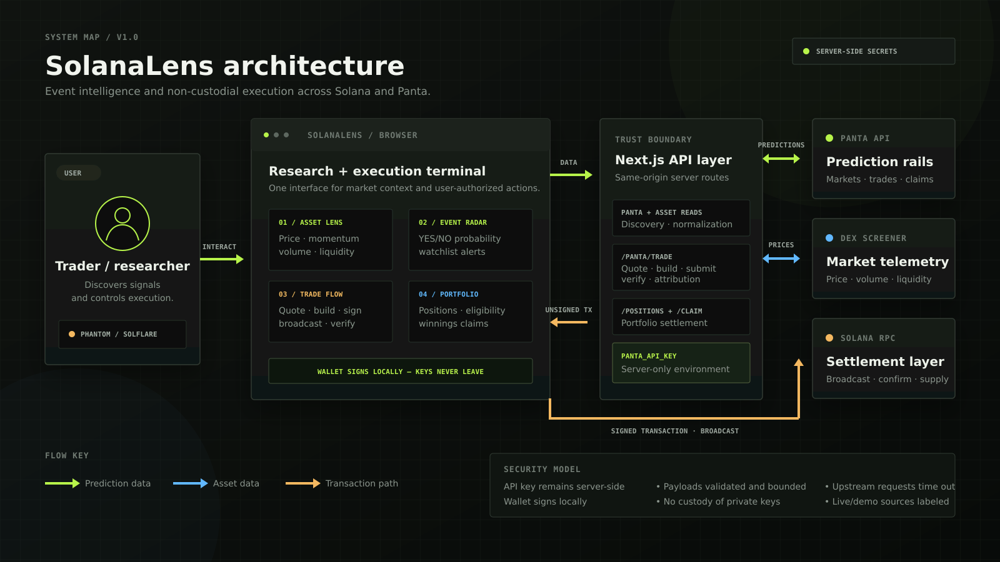

# SolanaLens

**See the event behind the move.**

SolanaLens is an event-risk intelligence terminal for Solana traders. It pairs
asset data with Panta prediction-market probabilities so users can understand
what the market expects, connect those expectations to Solana assets, and take
a YES or NO position without leaving the research workflow.

Built for the Colosseum Crypto World's Fair and the Panta API Side Track.

## Product thesis

Price charts show what happened. Prediction markets can help explain what the
market believes may happen next. SolanaLens turns that signal into a focused
workflow:

1. Monitor Solana ecosystem momentum.
2. Discover events related to an asset.
3. Compare probability, price movement, and conviction.
4. Trade the outcome through Panta's non-custodial transaction flow.
5. Track positions and claim eligible winnings.

## Current MVP

- Responsive market-intelligence dashboard
- Searchable Solana asset watchlist with live price, volume, liquidity, and market cap
- Event probability cards and selected-market analysis
- Transparent event-to-asset score: Panta probability 50%, momentum 30%, liquidity 20%
- Interactive YES/NO trade preview
- Server-only Panta API proxy with safe demo fallback
- Phantom and Solflare wallet connection
- Live Panta quote and unsigned-transaction build flow
- Wallet signing, Solana RPC broadcast, submit, verify, and trade attribution
- Wallet portfolio with live Panta positions and estimated claim value
- Claim-eligibility display and non-custodial winnings claim flow
- Persistent event watchlist with five-point probability-move alerts
- Clear live/demo data-source indicator
- Accessible mobile navigation and reduced-motion support

## Panta integration

The routes under `app/api/panta` call Panta from the server, keeping the API key
out of the browser. Market discovery safely falls back to clearly labelled demo
data when the key is unavailable. Trading remains disabled in demo mode.

Planned transaction flow:

`quote → build unsigned transaction → wallet signs → RPC broadcasts → report signature`

The wallet remains non-custodial throughout the flow.

## Stack

- Next.js 16 and React 19
- TypeScript
- Custom responsive CSS design system
- Panta API on Solana
- DEX Screener public API for Solana market data
- Solana RPC circulating supply for SOL market-cap calculation

## Architecture



The browser handles research and wallet approval, while same-origin Next.js
routes protect the Panta API key, validate requests, and connect to Panta, DEX
Screener, and Solana RPC. See the [demo script](./docs/demo-script.md) for the
recommended hackathon walkthrough.

## Local setup

```bash
npm install
cp .env.example .env.local
npm run dev
```

Add the test key only to `.env.local`:

```env
PANTA_API_KEY=pk_test_your_key
```

Never expose this key with a `NEXT_PUBLIC_` prefix or commit `.env.local`.

## Quality checks

```bash
npm run lint
npm run typecheck
npm run build
npm run test:smoke
```

The smoke suite boots the production build against a local mock Panta server.
It verifies market normalization, server-side API-key forwarding, endpoint
validation, payload limits, and the main application shell without spending
funds or contacting the live Panta API.

## Roadmap

- Confirm live catalog and transaction responses with a test key
- Expand event-to-asset relevance mapping and delivery channels for saved alerts
- Capture early-user feedback and usage evidence for the submission

## Hackathon materials

See [`SUBMISSION.md`](./SUBMISSION.md) for the English pitch, Panta integration
summary, demo flow, judging-criteria alignment, and final submission checklist.

## Status

The repository contains the working MVP interface, Solana wallet connection,
the complete Panta primary-buy path, wallet positions, and winnings claims.
Live API verification still requires the server-side test key.
